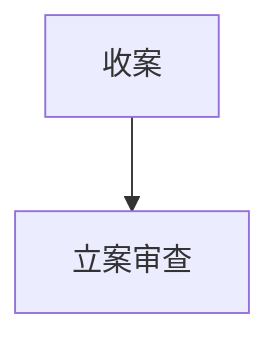

# 立案登记制

法院接到当事人提交的民事、行政起诉状时，对符合法定条件的起诉，应当登记立案；对当场不能判定是否符合起诉条件的，应当接收起诉材料，并出具注明收到日期的书面凭证。需要补充必要相关材料的，人民法院应当及时告知当事人。在补齐相关材料后，应当在七日内做出决定是否立案登记。

## 立案范围

有下列情形之一的，应当登记立案：
（一）与本案有直接利害关系的公民、法人和其他组织提起的民事诉讼，有明确的被告、具体的诉讼请求和事实依据，属于人民法院主管和受诉人民法院管辖的；
（二）行政行为的相对人以及其他与行政行为有利害关系的公民、法人或者其他组织提起的行政诉讼，有明确的被告、具体的诉讼请求和事实根据，属于人民法院受案范围和受诉人民法院管辖的；
（三）属于告诉才处理的案件，被害人有证据证明的轻微刑事案件，以及被害人有证据证明应当追究被告人刑事责任而公安机关、人民检察院不予追究的案件，被害人告诉，且有明确的被告人、具体的诉讼请求和证明被告人犯罪事实的证据，属于受诉人民法院管辖的；
（四）生效法律文书有给付内容且执行标的和被执行人明确，权利人或其继承人、权利承受人在法定期限内提出申请，属于受申请人民法院管辖的；
（五）赔偿请求人向作为赔偿义务机关的人民法院提出申请，对人民法院、人民检察院、公安机关等作出的赔偿、复议决定或者对逾期不作为不服，提出赔偿申请的。
有下列情形之一的，不予登记立案：
（一）违法起诉或者不符合法定起诉条件的；
（二）诉讼已经终结的；
（三）涉及危害国家主权和领土完整、危害国家安全、破坏国家统一和民族团结、破坏国家宗教政策的；
（四）其他不属于人民法院主管的所诉事项。
## 配套机制
（一）健全多元化纠纷解决机制。进一步完善调解、仲裁、行政裁决、行政复议、诉讼等有机衔接、相互协调的多元化纠纷解决机制，加强诉前调解与诉讼调解的有效衔接，为人民群众提供更多纠纷解决方式。
（二）建立完善庭前准备程序。完善繁简分流、先行调解工作机制。探索建立庭前准备程序，召集庭前会议，明确诉辩意见，归纳争议焦点，固定相关证据，促进纠纷通过调解、和解、速裁和判决等方式高效解决。
（三）强化立案服务措施。加强人民法院诉讼服务中心和信息化建设，实现公开、便捷立案。推行网上立案、预约立案、巡回立案，为当事人行使诉权提供便利。加大法律援助、司法救助力度，让经济确有困难的当事人打得起官司。
## 法律文件
最高人民法院关于人民法院登记立案若干问题的规定 [6] 
（2015年4月13日最高人民法院审判委员会第1647次会议通过）
法释〔2015〕8号
　为保护公民、法人和其他组织依法行使诉权，实现人民法院依法、及时受理案件，根据《中华人民共和国民事诉讼法》《中华人民共和国行政诉讼法》《中华人民共和国刑事诉讼法》等法律规定，制定本规定。
第一条 人民法院对依法应该受理的一审民事起诉、行政起诉和刑事自诉，实行立案登记制。
　　第二条 对起诉、自诉，人民法院应当一律接收诉状，出具书面凭证并注明收到日期。
　　对符合法律规定的起诉、自诉，人民法院应当当场予以登记立案。
　　对不符合法律规定的起诉、自诉，人民法院应当予以释明。
　　第三条 人民法院应当提供诉状样本，为当事人书写诉状提供示范和指引。
　　当事人书写诉状确有困难的，可以口头提出，由人民法院记入笔录。符合法律规定的，予以登记立案。
　　第四条 民事起诉状应当记明以下事项：
　　（一）原告的姓名、性别、年龄、民族、职业、工作单位、住所、联系方式，法人或者其他组织的名称、住所和法定代表人或者主要负责人的姓名、职务、联系方式；
　　（二）被告的姓名、性别、工作单位、住所等信息，法人或者其他组织的名称、住所等信息；
　　（三）诉讼请求和所根据的事实与理由；
　　（四）证据和证据来源；
　　（五）有证人的，载明证人姓名和住所。
　　行政起诉状参照民事起诉状书写。
　　第五条 刑事自诉状应当记明以下事项：
　　（一）自诉人或者代为告诉人、被告人的姓名、性别、年龄、民族、文化程度、职业、工作单位、住址、联系方式；
　　（二）被告人实施犯罪的时间、地点、手段、情节和危害后果等；
　　（三）具体的诉讼请求；
　　（四）致送的人民法院和具状时间；
　　（五）证据的名称、来源等；
　　（六）有证人的，载明证人的姓名、住所、联系方式等。
　　第六条 当事人提出起诉、自诉的，应当提交以下材料：
　　（一）起诉人、自诉人是自然人的，提交身份证明复印件；起诉人、自诉人是法人或者其他组织的，提交营业执照或者组织机构代码证复印件、法定代表人或者主要负责人身份证明书；法人或者其他组织不能提供组织机构代码的，应当提供组织机构被注销的情况说明；
　　（二）委托起诉或者代为告诉的，应当提交授权委托书、代理人身份证明、代为告诉人身份证明等相关材料；
　　（三）具体明确的足以使被告或者被告人与他人相区别的姓名或者名称、住所等信息；
　　（四）起诉状原本和与被告或者被告人及其他当事人人数相符的副本；
　　（五）与诉请相关的证据或者证明材料。
　　第七条 当事人提交的诉状和材料不符合要求的，人民法院应当一次性书面告知在指定期限内补正。
　　当事人在指定期限内补正的，人民法院决定是否立案的期间，自收到补正材料之日起计算。
　　当事人在指定期限内没有补正的，退回诉状并记录在册；坚持起诉、自诉的，裁定或者决定不予受理、不予立案。
　　经补正仍不符合要求的，裁定或者决定不予受理、不予立案。
　　第八条 对当事人提出的起诉、自诉，人民法院当场不能判定是否符合法律规定的，应当作出以下处理：
　　（一）对民事、行政起诉，应当在收到起诉状之日起七日内决定是否立案；
　　（二）对刑事自诉，应当在收到自诉状次日起十五日内决定是否立案；
　　（三）对第三人撤销之诉，应当在收到起诉状之日起三十日内决定是否立案；
　　（四）对执行异议之诉，应当在收到起诉状之日起十五日内决定是否立案。
　　人民法院在法定期间内不能判定起诉、自诉是否符合法律规定的，应当先行立案。
　　第九条 人民法院对起诉、自诉不予受理或者不予立案的，应当出具书面裁定或者决定，并载明理由。
　　第十条 人民法院对下列起诉、自诉不予登记立案：
　　（一）违法起诉或者不符合法律规定的；
　　（二）涉及危害国家主权和领土完整的；
　　（三）危害国家安全的；
　　（四）破坏国家统一和民族团结的；
　　（五）破坏国家宗教政策的；
　　（六）所诉事项不属于人民法院主管的。
　　第十一条 登记立案后，当事人未在法定期限内交纳诉讼费的，按撤诉处理，但符合法律规定的缓、减、免交诉讼费条件的除外。
　　第十二条 登记立案后，人民法院立案庭应当及时将案件移送审判庭审理。
　　第十三条 对立案工作中存在的不接收诉状、接收诉状后不出具书面凭证，不一次性告知当事人补正诉状内容，以及有案不立、拖延立案、干扰立案、既不立案又不作出裁定或者决定等违法违纪情形，当事人可以向受诉人民法院或者上级人民法院投诉。
　　人民法院应当在受理投诉之日起十五日内，查明事实，并将情况反馈当事人。发现违法违纪行为的，依法依纪追究相关人员责任；构成犯罪的，依法追究刑事责任。
　　第十四条 为方便当事人行使诉权，人民法院提供网上立案、预约立案、巡回立案等诉讼服务。
　　第十五条 人民法院推动多元化纠纷解决机制建设，尊重当事人选择人民调解、行政调解、行业调解、仲裁等多种方式维护权益，化解纠纷。
　　第十六条 人民法院依法维护登记立案秩序，推进诉讼诚信建设。对干扰立案秩序、虚假诉讼的，根据民事诉讼法、行政诉讼法有关规定予以罚款、拘留；构成犯罪的，依法追究刑事责任。
　　第十七条 本规定的“起诉”，是指当事人提起民事、行政诉讼；“自诉”，是指当事人提起刑事自诉。
　　第十八条 强制执行和国家赔偿申请登记立案工作，按照本规定执行。
　　上诉、申请再审、刑事申诉、执行复议和国家赔偿申诉案件立案工作，不适用本规定。
　　第十九条 人民法庭登记立案工作，按照本规定执行。
　　第二十条 本规定自2015年5月1日起施行。以前有关立案的规定与本规定不一致的，按照本规定执行。

# 立案流程

